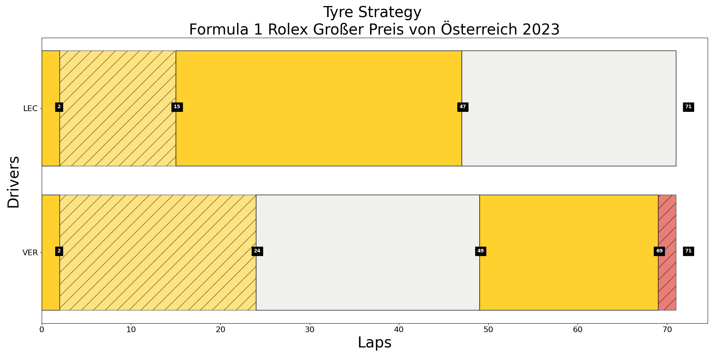

# How to Build a Distributed Big Data Pipeline Using Kafka, Cassandra, and Jupyter Lab with Docker plus Faker API and FastF1

This instruction is intended to deploy an end-to-end data pipeline on your local computer using Docker containerized Kafka (data streaming), Cassandra (NoSQL database) and Jupyter Lab (data analysis Visualization).


# Quickstart instructions

You need to apply for some APIs to use with this. The APIs might take days for application to be granted access. Sample API keys are given, but it can be blocked if too many users are running this.

OpenWeatherMap API: https://openweathermap.org/api 

After obtaining the API keys, please update the files "owm-producer/openweathermap_service.cfg" accordingly.

#Create docker networks
```bash
$ docker network create kafka-network                         # create a new docker network for kafka cluster (zookeeper, broker, kafka-manager services, and kafka connect sink services)
$ docker network create cassandra-network                     # create a new docker network for cassandra. (kafka connect will exist on this network as well in addition to kafka-network)
```
## Starting Cassandra

Cassandra is setup so it runs keyspace and schema creation scripts at first setup so it is ready to use.
```bash
$ docker-compose -f cassandra/docker-compose.yml up -d
```

## Starting Kafka on Docker
```bash
$ docker-compose -f kafka/docker-compose.yml up -d            # start single zookeeper, broker, kafka-manager and kafka-connect services
$ docker ps -a                                                # sanity check to make sure services are up: kafka_broker_1, kafka-manager, zookeeper, kafka-connect service
```

> **Note:** 
Kafka-Manager front end is available at http://localhost:9000

You can use it to create cluster to view the topics streaming in Kafka.


IMPORTANT: You have to manually go to CLI of the "kafka-connect" container and run the below comment to start the Cassandra sinks.
```
./start-and-wait.sh
```

## Starting Producers
```bash
$ docker-compose -f faker-producer/docker-compose.yml up -d     # start the producer to generate faker data
$ docker-compose -f owm-producer/docker-compose.yml up -d     # start the producer that retrieves open weather map
$ docker-compose -f f1-producer/docker-compose.yml up # start the producer for fastf1
```
> **IMPORTANT:**
Before starting the producer for fastf1, start the consumer first then the producer for fastf1, so that the consumer can ingest all of the data produced by fastf1.
## Starting Weather, Faker and FastF1 Consumers

Start the consumers:
```bash
$ docker-compose -f consumers/docker-compose.yml up       # start the consumers
```

## Check that data is arriving to Cassandra

First login into Cassandra's container with the following command or open a new CLI from Docker Desktop if you use that.
```bash
$ docker exec -it cassandra bash
```
Once loged in, bring up cqlsh with this command and query weatherreport, fakerdata and lapsummary tables like this:
```bash
$ cqlsh -f schema.cql

$ cqlsh -f schema-faker.cql

$ cqlsh --cqlversion=3.4.4 127.0.0.1 #make sure you use the correct cqlversion

cqlsh> use kafkapipeline; #keyspace name

cqlsh:kafkapipeline> select * from weatherreport;

cqlsh:kafkapipeline> select * from fakerdata;

cqlsh:kafkapipeline> select * from lapsummary;
```

And that's it! you should be seeing records coming in to Cassandra. Feel free to play around with it by bringing down containers and then up again to see the magic of fault tolerance!


## Visualization

Run the following command the go to http://localhost:8888 and run the visualization notebook accordingly

```
docker-compose -f data-vis/docker-compose.yml up -d
```

## Teardown

To stop all running kakfa cluster services

```bash
$ docker-compose -f data-vis/docker-compose.yml down # stop visualization node

$ docker-compose -f consumers/docker-compose.yml down          # stop the consumers

$ docker-compose -f owm-producer/docker-compose.yml down       # stop open weather map producer

$ docker-compose -f faker-producer/docker-compose.yml down       # stop faker producer

$ docker-compose -f fastf1-producer/docker-compose.yml down   # stop fastf1 producer (optional since it closes automatically after completing sending laps for two drivers)

$ docker-compose -f kafka/docker-compose.yml down              # stop zookeeper, broker, kafka-manager and kafka-connect services

$ docker-compose -f cassandra/docker-compose.yml down          # stop Cassandra
```

To remove the kafka-network network:

```bash
$ docker network rm kafka-network
$ docker network rm cassandra-network
```

To remove resources in Docker

```bash
$ docker container prune # remove stopped containers, done with the docker-compose down
$ docker volume prune # remove all dangling volumes (delete all data from your Kafka and Cassandra)
$ docker image prune -a # remove all images (help with rebuild images)
$ docker builder prune # remove all build cache (you have to pull data again in the next build)
$ docker system prune -a # basically remove everything
```

# API Information on Task 3

I decided to use the FastF1 package by theOehrly (Philipp Schaefer). It is a Python package for accessing and analyzing Formula 1 results, schedules, timing data and telemetry.

FastF1 is largely built on top of Pandas DataFrames and Series. But it adds its own convenient methods for working specifically with F1 data. This makes it much easier to get started and work with the data in general.

FastF1's robust functionality makes it an ideal choice for my project, as I myself am an avid Formula 1 enjoyer, so using the package demonstrates my ability of analyzing data from the race and transforming it into meaningful insights.

# Brief Explanation on Visualizations


<p style="text-align:center;">Figure 1. Lap Time across Race between Verstappen and Leclerc</p>

In **Figure 1**, Verstappen is quicker than Leclerc in the first stint (until lap 14 and excluding laps under Safety Car). And despite pitting later (around lap 25), Verstappen is still faster than his rival while being on slower tyres. Verstappen's pace is so rapid that he has a gap to make another pit stop, which leads us to Figure 2 (below).


<p style="text-align:center;">Figure 2. Tyre Strategy between Verstappen and Leclerc</p>

In **Figure 2**, it can be seen that Verstappen has a different tyre strategy (Medium - Hard - Medium) compared to Leclerc's (Medium - Medium - Hard) before the start of lap 70 out of 71. By the end of lap 69, Verstappen is about 24 seconds ahead of Leclerc so he pits for soft tyres in order to take the fastest lap and gain a bonus point at the end of lap 71.

# Practical Implications of the Project
The project showcases how multiple datasets can be utilized to address specific use cases and scenarios in fields like sports analytics, environmental monitoring, and synthetic data generation. The integration of these APIs allows users to explore insights in an innovative way that is both comprehensive and tailored to their needs.

## Use Case and Scenario
+ **OpenWeatherMap**: Organizations often struggle with unpredictable environmental conditions affecting outdoor events, construction projects, or transportation logistics. The absence of accurate, up-to-date weather data can lead to inefficiencies, delays, or safety risks. Decision-makers need a reliable source to anticipate and prepare for weather-related disruptions.

+ **Faker**: Developing and testing data-driven applications typically require access to large datasets, which can pose significant privacy risks if real user data is utilized. Additionally, many developers face challenges when real datasets are unavailable, inconsistent, or incomplete, creating roadblocks in building and validating robust systems.

+ **FastF1**: Analyzing Formula 1 races involves managing a vast amount of performance data, including lap times, tyre strategies, and telemetry. Fans and amateur analysts often lack an accessible and detailed dataset to derive meaningful insights into driver performance and race context. This gap hinders in-depth understanding and engagement with the sport.

## Problem Solving
This project demonstrates how utilizing multiple APIs can provide a multifaceted approach to data-driven problem-solving:

+ **OpenWeatherMap**: For scenarios such as planning outdoor events or understanding weather impacts on various operations, the approach enables users to retrieve accurate weather data for any location. By providing detailed metrics like temperature, humidity, and wind conditions, the API allows for tailored solutions. For example, event organizers can anticipate weather disruptions and take preventative measures, enhancing safety and efficiency.

+ **Faker**: Faker solves the problem of generating non-sensitive data for testing purposes. This approach is invaluable for scenarios where live user data cannot be used, such as system development or training machine learning models. By creating mock datasets with attributes like names, addresses, and job titles, developers can rigorously test applications under simulated conditions.

+ **FastF1**: The FastF1 API is used to analyze and visualize Formula 1 race data, solving the problem of extracting insights from complex telemetry and timing data. Teams can use these insights to optimize their tactics, while fans and analysts gain a deeper understanding of race dynamics. The detailed data provided by FastF1 creates opportunities for both technical and narrative engagement with the sport, enriching the user experience.